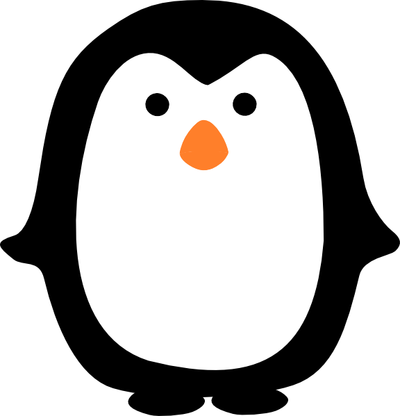

# User Page: Eddie Li

This is a **penguin**. I like *penguins*.



This is the last line of one of my favorite books.

> So we beat on, boats against the current, borne back ceaselessly into the past.

This is a line of code in Rust.


```
println!("I am currently learning Rust for a project and I enjoy working with the language about as much as playing Rust, the game.");
```

This is a [link](https://www.youtube.com/watch?v=dQw4w9WgXcQ&ab_channel=RickAstley/) to my favorite video!


This is a [link](#user-page) back to the start of the page, because why not.

This is a [link](penguin.png) to the image of the penguin.

Here is a list of things I enjoy

- Pizza
- Sleep
- Shuffling poker chips

Here is an ordered list of the things I enjoy, just in case the previous list wasn't clear enough.

1. Pizza
2. Sleep
3. Shuffling poker chips

Here is a typical todo list for my average week.

- [ ] Procrastinate on my homework
- [ ] Buy Costco chicken bakes so I don't starve
- [ ] Cure cancer

:D